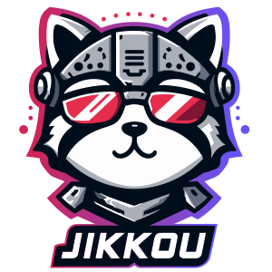
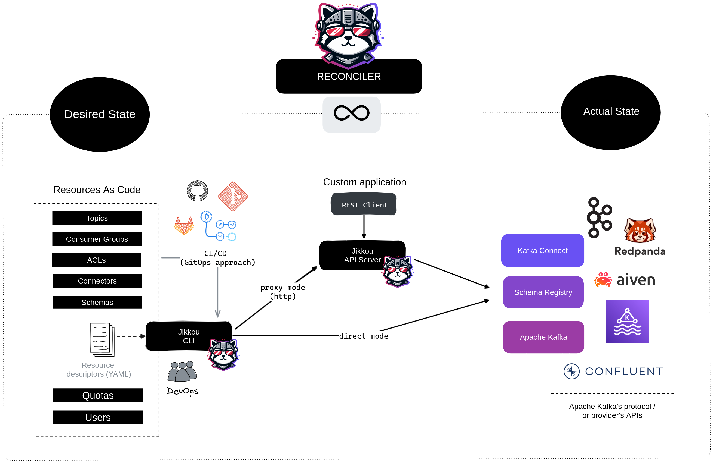

<p align="center">
  
</p>

<h3 align="center">Resource as Code for Apache Kafka and beyond</h3>
<p align="center">
  Topics, ACLs, schemas, quotas, and connectors: declared in Git, reconciled against your real clusters.<br/>
  Kafka-first. Platform-ready.
</p>

<p align="center">
  <a href="https://github.com/streamthoughts/jikkou/actions/workflows/maven-build.yml"></a>
  <a href="https://github.com/streamthoughts/jikkou/blob/main/LICENSE"></a>
  <a href="https://github.com/streamthoughts/jikkou/releases"></a>
  <a href="https://github.com/streamthoughts/jikkou/stargazers"></a>
</p>

<p align="center">
  <a href="https://sonarcloud.io/dashboard?id=streamthoughts_jikkou"></a>
  <a href="https://sonarcloud.io/dashboard?id=streamthoughts_jikkou"></a>
  <a href="https://sonarcloud.io/dashboard?id=streamthoughts_jikkou"></a>
</p>

<p align="center">
  <a href="https://jikkou.io/">Documentation</a> &bull;
  <a href="https://jikkou.io/docs/install/">Install</a> &bull;
  <a href="https://jikkou.io/docs/tutorials/">Tutorials</a> &bull;
  <a href="https://join.slack.com/t/jikkou-io/shared_invite/zt-27c0pt61j-F10NN7d7ZEppQeMMyvy3VA">Slack</a>
</p>

---

**Your platform team runs Kafka for everyone else.** Fifty app teams, and every new topic is a ticket.
Configs drift between staging and production because someone "fixed" something by hand during an incident.
Nobody can say who changed what, or why.

**Jikkou** (jikkou / 実行, *execution* in Japanese) fixes this the way `kubectl` fixed Kubernetes:
declare your Kafka resources (topics, ACLs, quotas, schemas, connectors) as YAML in Git, review changes
in pull requests, and let Jikkou reconcile the desired state against your **real clusters**. Kafka-first,
and platform-ready: the same engine manages Schema Registry, Kafka Connect, Confluent Cloud, Aiven,
Amazon MSK, AWS Glue, and Apache Iceberg.

<p align="center">
  
</p>

## Why Jikkou?

| Your problem | Jikkou's answer |
|---|---|
| "Someone changed a topic by hand and nobody noticed" | **Stateless reconciliation.** No state file; `jikkou diff` compares Git against the actual cluster, so drift is always visible |
| "300 topics that differ by one value" | **Jinja templating.** One definition, per-environment values files |
| "Same config must land on five clusters" | **Multi-cluster apply.** Provider groups target a whole fleet in one command |
| "Every change needs review and an audit trail" | **GitOps-native.** YAML in Git, `diff` in the pull request, `apply` in CI |
| "We can't let a typo reach production" | **Validations & dry-run.** Platform rules (naming, min ISR, partition limits) enforced before anything is applied |
| "We also run Schema Registry, Connect, Iceberg…" | **One agnostic engine.** Pluggable providers, one resource model across your whole data platform |

## How Jikkou Compares

- **[Jikkou vs Terraform](https://www.jikkou.io/docs/comparisons/jikkou-vs-terraform/)**: Terraform provisions clusters; Jikkou manages what lives inside them, without a state file to drift.
- **[Jikkou vs Strimzi Topic Operator](https://www.jikkou.io/docs/comparisons/jikkou-vs-strimzi/)**: on Strimzi, keep the Topic Operator for topics; Jikkou covers everything it can't reach.

## Quick Start

### Install

```bash
# Via SDKMan (recommended)
sdk install jikkou

# Or via Docker
docker pull streamthoughts/jikkou
```

> See the full [installation guide](https://jikkou.io/docs/install/) for native binaries, Homebrew, and more.

### Define a Kafka topic

```yaml
# kafka-topics.yaml
apiVersion: 'kafka.jikkou.io/v1beta2'
kind: 'KafkaTopic'
metadata:
  name: 'my-topic'
spec:
  partitions: 12
  replicas: 3
  configs:
    min.insync.replicas: 2
```

### Preview, then apply

```bash
# Preview the change against the real cluster, not a state file
jikkou diff --files ./kafka-topics.yaml

# Apply it
jikkou apply --files ./kafka-topics.yaml
```

That's it. Jikkou computes the diff and applies only the necessary changes:

```
TASK [CREATE] Create a new topic my-topic (partitions=12, replicas=3) - CHANGED
EXECUTION in 2s 661ms
ok: 0, created: 1, altered: 0, deleted: 0, failed: 0
```

## One Model, Every Platform

The same declarative YAML model covers your entire streaming platform. And because the engine is
platform-agnostic, it extends beyond Kafka: Apache Iceberg tables, views, and namespaces are managed
with the exact same workflow.

| Apache Kafka | Schema Registry | Kafka Connect | Apache Iceberg | Cloud Providers |
|:---:|:---:|:---:|:---:|:---:|
| Topics & Configs | Avro Schemas | Connectors | Tables | Aiven (ACLs, Quotas) |
| ACLs | JSON Schemas | | Views | Confluent Cloud (RBAC) |
| Quotas | Protobuf Schemas | | Namespaces | AWS Glue Schemas |
| Consumer Groups | | | | |
| Brokers & Users | | | | |
| KTable Records | | | | |

## How It Works

<p align="center">
  
</p>

Jikkou follows a simple reconciliation loop:

1. **Read** your resource definitions from YAML files (with Jinja templating support)
2. **Compute** the differences between desired state and actual cluster state
3. **Apply** only the minimal set of changes needed
4. **Report** what was created, updated, or deleted

## Deployment Modes

| Mode              | Description                                                                                   |
|-------------------|-----------------------------------------------------------------------------------------------|
| **CLI**           | Run as a command-line tool — perfect for local development and CI/CD pipelines                |
| **API Server**    | Run as a REST API server — ideal for platform teams and automation                            |
| **Docker**        | Available as container images on [Docker Hub](https://hub.docker.com/r/streamthoughts/jikkou) |
| **Native Binary** | GraalVM-compiled native executables for instant startup                                       |

## Use Jikkou with AI Agents

Jikkou ships official [Agent Skills](https://agentskills.io) so coding agents can manage
your Kafka resources through the CLI — with validation and dry-runs built into the workflow.

**Claude Code:**

```
/plugin marketplace add streamthoughts/jikkou
/plugin install jikkou
```

**Other agents:** copy [`skills/managing-kafka-resources`](./skills/managing-kafka-resources) into your agent's skills directory.

The skill never applies changes without showing a diff or dry-run first, and asks before
installing anything.

## Documentation

Full documentation is available at **[jikkou.io](https://jikkou.io/)**.

- [Getting Started](https://jikkou.io/docs/install/)
- [Concepts & Architecture](https://jikkou.io/docs/concepts/)
- [Providers Reference](https://jikkou.io/docs/providers/)
- [Tutorials](https://jikkou.io/docs/tutorials/)

## Developers

For build instructions, development setup, and contribution guidelines, see:

- **[CONTRIBUTING.md](./CONTRIBUTING.md)** — How to contribute, coding guidelines, commit conventions
- **[AGENTS.md](./AGENTS.md)** — Detailed development guidelines, build commands, and architecture

### Quick Build

```bash
# Build and run all tests
./mvnw clean verify

# Build without tests
./mvnw clean verify -DskipTests

# Apply code formatting
./mvnw spotless:apply
```

**Requirements:** Java 25, Docker (for integration tests), GraalVM (for native builds)

## Contributors

Jikkou is built by its community. Thank you to everyone who has contributed!

<!-- CONTRIBUTORS-START -->
<a href="https://github.com/streamthoughts/jikkou/graphs/contributors">
  
</a>
<!-- CONTRIBUTORS-END -->

Want to see your name here? Check out the [contribution guide](./CONTRIBUTING.md) and [open issues](https://github.com/streamthoughts/jikkou/issues).

## Support the Project

If you find Jikkou useful, please consider:

- **Using Jikkou in production?** Add your organization to [ADOPTERS.md](./ADOPTERS.md) or [tell us in GitHub Discussions](https://github.com/streamthoughts/jikkou/discussions): real-world usage reports help the project more than anything else
- Giving it a **[star on GitHub](https://github.com/streamthoughts/jikkou)** to help others discover it
- Joining the **[Slack community](https://join.slack.com/t/jikkou-io/shared_invite/zt-27c0pt61j-F10NN7d7ZEppQeMMyvy3VA)** to ask questions and share feedback
- **[Contributing](./CONTRIBUTING.md)** code, documentation, or bug reports

## License

Licensed under the [Apache License, Version 2.0](./LICENSE).

---

<p align="center">
  Developed with &#10084; by <a href="https://github.com/fhussonnois">Florian Hussonnois</a> and the Jikkou community.
</p>
